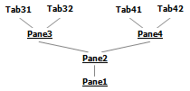

# MultiPaneCtrl


## Introduction

The control allows you to create hierarchically nested areas, each of which may have tabs. Using the mouse, the user has the ability to move tabs with them and related child windows. This allows the user to customize the location and size of working areas to their liking. One possible use of `MultiPaneCtrl` is as a window filling the client area of the frame. The result is a simple, easily configurable interface.

This control is based on the `CWnd` class and can be placed as a child window anywhere, for example, in the client area of a frame or in a dialog.

## Using the Code

Each pane can be in one of two states:

1. Be empty (do not have child panes and tabs) or have tabs.
2. Have child panes (to be a line).

The current state is determined by the function `IsLine`. Many functions can be called for panes in only one of two states.

The basic rules for working with the control are:

1. Root pane is created when you create `MultiPaneCtrl` and you can not delete it.
2. In all operations, instead of a handle of the root pane (`GetRootPane`), you can use NULL.
3. Adding tabs and converting to a line can only be done for panes that don’t have child panes.
4. When you convert a pane to a line, a child pane is created for it, which is passed all the tabs of the converted pane.
5. When you delete a pane, its tabs pass to the parent pane, provided that the pane being deleted is the only child of its parent pane.

##### Here is an example of the algorithm for creating the `MultiPaneCtrl` (fill panes and tabs):

1. Initial state.

   

2. Adding tabs to the root pane (`MultiPaneCtrl::AddTab`).

   

3. Conversion the root pane to a line (`MultiPaneCtrl::ConvertPaneToLine`).

   

4. Adding a child pane to the root pane (`MultiPaneCtrl::AddPane`).

   

5. Conversion Pane2 to a line (`MultiPaneCtrl::ConvertPaneToLine`).

   

6. Adding a child pane to Pane2 (`MultiPaneCtrl::AddPane`).

   

7. Adding tabs to Pane3 and Pane4 (`MultiPaneCtrl::AddTab`).

   

##### Removing panes from `MultiPaneCtrl`. Example 1:

1. Initial state.

   

2. Removing Pane3 (`MultiPaneCtrl::DeletePane`).

   

3. Removing Pane2 (`MultiPaneCtrl::DeletePane`).

   

##### Removing panes from `MultiPaneCtrl`. Example 2:

1. Initial state.

   

2. Removing Pane2 (`MultiPaneCtrl::DeletePane`).

   

For each pane which doesn’t have child panes, by default, a `TabCtrl` control is created. This control is also developed by me, and you can find it at https://github.com/baradzenka/TabCtrl . All `TabCtrl` controls are created as child windows for `MultiPaneCtrl` and do not form additional levels of nesting. This is especially important because modern versions of Windows have a limited number of nesting windows in each other, which often does not exceed 13-15. The function `GetTabCtrl` allows you to get a pointer to `TabCtrl`. It can be called only for a pane which is not a line. You can use this pointer for a specific tabbed pane, or you can simply call methods of the `MultiPaneCtrl` class to manipulate the tabs. For example, to add a tab to a pane, use the function `MultiPaneCtrl::AddTab`.

To create the control and add elements to it, you can do the following steps:

```cpp
#include "MultiPaneCtrl.h"

MultiPaneCtrlEx< MultiPaneCtrlStyle_VS2003_client > m_MultiPaneCtrl;
CTreeCtrl m_Tree1, m_Tree2;
CEdit m_Edit1;
CListCtrl m_List1, m_List2;

...

// Creation and initialization of child windows.
if( !m_Tree1.Create(WS_CHILD | TVS_HASBUTTONS | TVS_HASLINES,CRect(0,0,0,0),this,ID_Tree1) ||
    !m_Tree2.Create(WS_CHILD | TVS_HASBUTTONS | TVS_HASLINES,CRect(0,0,0,0),this,ID_Tree2) ||
    !m_Edit1.Create(WS_CHILD | ES_MULTILINE,CRect(0,0,0,0),this,ID_Edit1) ||
    !m_List1.Create(WS_CHILD | LVS_REPORT,CRect(0,0,0,0),this,ID_List1) ||
    !m_List2.Create(WS_CHILD | LVS_REPORT,CRect(0,0,0,0),this,ID_List2) )
    return -1;    // error.

m_Tree1.InsertItem("CTreeCtrl 1");
m_Tree2.InsertItem("CTreeCtrl 2");
m_Edit1.SetWindowText("CEdit 1");
m_List1.InsertColumn(0,"CListCtrl 1",LVCFMT_LEFT,100);
m_List1.InsertItem(0,"Item 1");
m_List2.InsertColumn(0,"CListCtrl 2",LVCFMT_LEFT,100);
m_List2.InsertItem(0,"Item 1");

// Creation of MultiPaneCtrl object.
if( !m_MultiPaneCtrl.Create(this,WS_CHILD | WS_VISIBLE, CRect(0,0,400,300),ID_MultiPaneCtrl) )
    return -1;    // error.

m_MultiPaneCtrl.CreateSystemImages(nullptr,IDB_IMAGES_SYSTEM,true,14);
m_MultiPaneCtrl.CreateImages(nullptr,IDB_IMAGES_TAB_NORMAL,IDB_IMAGES_TAB_DISABLE,true,16);

m_MultiPaneCtrl.SetCursors(IDC_TAB, IDC_SPLITTER_HORZ,IDC_SPLITTER_VERT,
    IDC_DRAGOUT_ENABLE,IDC_DRAGOUT_DISABLE);

m_MultiPaneCtrl.SetDockingMarkers( MarkersLayoutC(), 50);
m_MultiPaneCtrl.EnableTabRemove(true);
m_MultiPaneCtrl.EnableTabDrag(true);

// Loading state or creation default state.
MultiPaneCtrl::Tabs tabs;
tabs.Add(m_Tree1,"Tree1",-1);
tabs.Add(m_List1,"List1",0);
tabs.Add(m_Edit1,"Edit1",1);
tabs.Add(m_List2,"List2",2);
tabs.Add(m_Tree2,"Tree2",3);

if( !m_MultiPaneCtrl.LoadState(AfxGetApp(),"MultiPaneCtrl","State",&tabs,false) )
{
    // Create default state.
    HPANE h1 = m_MultiPaneCtrl.ConvertPaneToLine(NULL,false);
        m_MultiPaneCtrl.AddTab(h1,tabs[0]);
        m_MultiPaneCtrl.AddTab(h1,tabs[1]);

    HPANE h2 = m_MultiPaneCtrl.AddPane(NULL);

        HPANE h3 = m_MultiPaneCtrl.ConvertPaneToLine(h2,true);
            m_MultiPaneCtrl.AddTab(h3,tabs[2]);

        HPANE h4 = m_MultiPaneCtrl.AddPane(h2);
            HPANE h5 = m_MultiPaneCtrl.ConvertPaneToLine(h4,false);
                m_MultiPaneCtrl.AddTab(h5,tabs[3]);

            HPANE h6 = m_MultiPaneCtrl.AddPane(h4);
                m_MultiPaneCtrl.AddTab(h6,tabs[4]);

    m_MultiPaneCtrl.SetLinesEqualPanesSize();
}

m_MultiPaneCtrl.Update();
````

The control doesn’t perform any drawing, and for this, it calls methods of the interface `MultiPaneCtrl::Draw`. Also, for determining the thickness of the border and splitters, it uses an interface `MultiPaneCtrl::IRecalc`. User operations are defined by methods of the interface `MultiPaneCtrl::Ability`. These include the ability to insert the pane in a certain area when you drag it with the mouse, as well as showing system buttons (close, menu, scroll). In general, for proper working of the control, it needs to set the style. To do this, you must implement the functions of the `MultiPaneCtrl::IStyle` interface and pass a pointer to it using the method `InstallStyle`. Besides pointers to the above interfaces, you must return a pointer to the interface `ITabCtrlStyle` (see an article about `TabCtrl` https://github.com/baradzenka/TabCtrl ). This will be used to define the appearance and behavior of all tabs in the control. The style class object (implementation of the `MultiPaneCtrl::IStyle` interface) must exist while the control is running. To do this, you can create an intermediate class like the `MultiPaneCtrlComplex` described in the DemoDlg.h file. If you are working with only one style, then use the template class `MultiPaneCtrlEx`. The class name of the style is defined as a template parameter, for example:

```cpp
MultiPaneCtrlEx< MultiPaneCtrlStyle_VS2003_client > m_MultiPaneCtrl;
````

Some styles have already been created. For example, styles similar to the docking/floating panels in Visual Studio 2003, 2008, 2010, and 2019. To create your own styles, see the classes `MultiPaneCtrlStyle_VS2003_client`, `MultiPaneCtrlStyle_VS2008_client_classic` etc.

In the process of pulling tabs with the mouse for better visualization, we can use markers. They appear on the panes, and when you hover on them, they show the position of the future insertion of the tab. To use them, you need to call `SetDockingMarkers`. One of the parameters of this function is an object for defining the graphic resources of markers and the location of their parts on the screen to create the appearance of the marker. This demo project includes five classes (`MarkersLayoutA` ... `MarkersLayoutE`) describing the appearance of markers.

<p align="center">

</p>

They are located in the DemoDlg.h file and allow you to create markers similar to those used in VS2003, VS2008, VS2010 and VS2019. To construct your own markers, use these classes as examples, also see information in the DockingMarkers.h file.

By calling the `DisableDockingMarkers` function, you can opt out of displaying markers and replace them with an outline display of areas where a dragging tab can be inserted.

The control does not send messages to the parent window and uses an interface `MultiPaneCtrl::Notify` for the notification of the events. Use `SetNotifyManager` to set the pointer to your implementation of `MultiPaneCtrl::Notify`.

The control requires a call to `Update` after you add or delete tabs, as well as change its properties and state.

The loading of the control's state depends on the contents of the `MultiPaneCtrl::Tabs` object. It should store information about the tabs that can be added to the control when loading its state from the registry or `CArchive`. You can fill `MultiPaneCtrl::Tabs` with information about all the tabs that the control currently has (`MultiPaneCtrl::GetAllTabs`) or add tabs manually (`MultiPaneCtrl::Tabs::Add`).

Good luck! :-)
